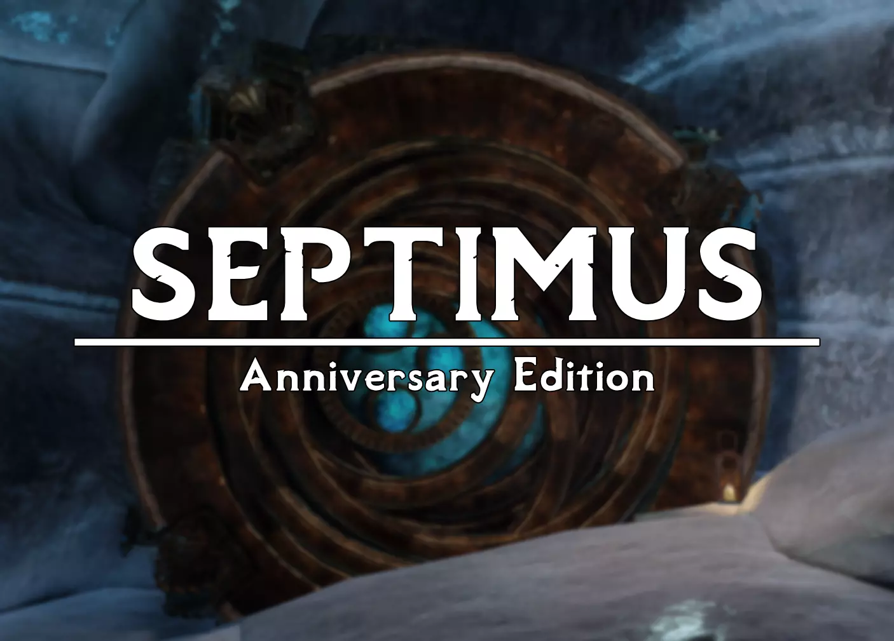

---

  <a href="https://www.nexusmods.com/skyrimspecialedition/mods/58229">Nexus Page</a> ·
  <a href="README.md">Installation</a> ·
  <a href="GAMEPLAY.md">Gameplay Guide</a> ·
  <a href="CONFIGURATION.md">Configuration</a> ·
  <a href="CHANGELOG.md">Changelog</a> ·
  <a href="ADDONS.md">Addons</a> ·
  <a href="HELP.md">Help</a>

---

# Changelog

## Version 3.0.4 [Unreleased]
+ Added No Item Planted pop-up
+ Added King Olaf's Fire Festival Not Ending Fix
+ Added Custom Septimus NPC Overhaul :D
+ Added Legacy of the Dragonborn - Gallery Gift Shop
+ Added Proving Honor Companions Quest Progression Fix
+ Added NPCs Wear Amulets of Mara
+ Added Skyland Real Tundra
+ Added Skyland - Raven Rock
+ Added Lucien - Room Markers for Dumzbthar
+ Added Neutral Hjerim
+ Added Legacy of the Dragonborn Collectors and Vendors
+ Added LOTD Fate Card Packs
+ Added Custom Blade and Blund - Realistic Melee Range patch
+ Updated Skyland AIO (And removed redundant mods)
+ Updated Adamant
+ Updated Mysticism
+ Tweaked Gray Cowl (Modded Quest) Artifacts
+ Tweaked Konahrik's Accoutrements Crafting Recipes
+ Fixed Duplicate Lanterns in Winterhold
+ Fixed Perk tailoring perk text
+ Fixed Modded Bound weapons not using adamant perks properly
+ Fixed Super Bright Hay Textures

## Version 3.0.3.1
+ Removed Leftover Village of Old Hrodan ESP

## Version 3.0.3

**Warning: Please make sure to leave the area of Old Hrodan before updating**

+ Added Skyland - Dawnguard
+ Added Magical College of Winterhold ELFX Patch
+ Added Miscellaneous Equip Text Removal
+ Added Baggage - CC Backpacks Rebalance + Custom Patches
+ Added Nordic UI - Compass Restored
+ Added Project AHO - Mysticism Spell Crafting
+ Added Yet Another Coffee Mod (For Apothecary)
+ Added Webmetz's Growables (Wyrmstooth, Vigilant, 3DNPCS)
+ Added Arena - Encounter Zone Overhaul (Unlock OWL encounter zones)
+ Updated Thaumaturgy
+ Updated Adamant
+ Updated Mysticism 2
+ Updated Arcane Accessories - Adamant Patch
+ Tweaked Simply Stronger Dragons to 1.5x Strength (Instead of 2x Strength)
+ Fixed Silver Items Broken UVs
+ Fixed Terrain Parallax Issues in Yuevie's ENB
+ Fixed CC Exotic Arrows now require the inventor perk
+ Fixed Crafting recipe consistency for path of might
+ Fixed Coffee Tankard Effects
+ Fixed Plant clipping in whiterun
+ Removed CC's Fort Dawnguard
+ Removed Northfire's Fort Dawnguard
+ Removed No NPC Greetings

## Version 3.0.2.2

**Before updating, dismiss any exising followers**
+ Remove Follower Framework (Broken AF)
+ Fix Nordic UI Widescreen finally

## Version 3.0.2.1
+ Fix missing nordic ui widescreen patch
+ Fix missing fnis plugin on SE profile

## Version 3.0.2

**Before updating, dismiss any exising followers**

+ Update Simple Follower Framework
+ Fix Some Rare Animation Crashing
+ Fixed Nordic UI Ultrawide Issues
+ Fixed Main Quest Lexicon Issue (hehe)

## Version 3.0.1
+ Fixed Some Facepaints being broken
+ Fixed Nordic UI Crosshair
+ Fixed Pilgrim Extra Strong Effects
+ Fixed Paraglider Issues

## Version 3.0.0
!!!!!!!!!!!!!!!!!!!!!!!!!!!!!!!!!!!!!

+ Added Nordic UI (optional) + Lots of Patches
+ Added Marked Treasure
+ Added Necromantic Grimoire Mihail Bone Colossus Replacer
+ Added Serana Animation Disabler (Disable some weird animations)
+ Added Northern Shores (Landscape  textures)
+ Added Greybeards of Power
+ Added Maids II - Deception (Jk jk jk... unless...)
+ Added ESO Cursor
+ Updated Septimus Uncapper Preset
+ Fixed Floating Bags in Falkreath
+ Fixed Conjuration Perk not attainable
+ Fixed Weird water near solitude

## Version 3.0.0 [BETA 5]

Hopefully the final (TM) beta for 3.0.0 before release !!!!!!

+ Added Road Generator for clear map
+ Added Embers XD (Replaces Embers HD)
+ Added Mannequin Management - LOTD Patch
+ Added Hitting the Books - A Necromantic Grimoire Update
+ Added Necromantic Grimoire Tome Distribution Patch
+ Added MYSTICISM 2!!!!!!!!
+ Added Unique Stros M'Kai Rum + Leveled List Patch
+ Added Beards of Power - NPC Patch
+ Added Simple Horse Tweaks
+ Added Simple Follower Extension + Interesting NPCs Patch
+ Added zzjay Horse Overhaul + CC Horses Patch
+ Added Hale Horses Retexture
+ Added Skyland Sovngarde
+ Added Adamant Plus Ten Smithing
+ Updated Antiquary + Patches
+ Fixed CFTO Conflicts with new city mods
+ Fixed Blue Mage Robes named incorrectly
+ Fixed Clear Map being overwritten at worldspace level
+ Fixed ASLAL Starting Items (Some were still not iron tier)
+ Fixed Heavy Blue Dungeon Glow (Hopefully for real this time)
+ Removed Embers HD (Replaced by Embers XD)

## Version 3.0.0 [BETA 4]
+ Added Ancient Nord Armoury Lite
+ Added A Clear Map of Skyrim and Other Worlds
+ Added Midwood Mysticism onsistency Patch
+ Added Wyrmstooth Mysticism Consistency Patch
+ Added Alpha Wolves Enabled
+ Added Yet Another Soul Trap Mod + Patches
+ Added Yuevie's Minimal ENB
+ Added QW's Grass Patch - Septimus Edition
+ Added HD Executioner's Block
+ Added Capitals and Towns of Skyrim + Custom Patches
+ Added Veydosebrom Regions (For Grass)
+ Added Better Third Person Selection
+ Added Fashions of the Fourth Era + OWL Patch + Balance Tweaks
+ Added Skyland Skyhaven Temple
+ Added Starting Spell Selection + Custom Edits
+ Added The Village of Skaal
+ Added The Village of Old Hrodan
+ Added Windhelm Fence 3D
+ Added More To Do In Hammerfel
+ Added House of Horrors Quest Expansion + BUVARP Patch
+ Added Skyrim Horse Renewal (For Animations)
+ Added Custom Horse Speed Tweaks
+ Added Custom Survival Mode Cold and Warmth Tweaks
+ Added Community Pre-made Character Presets Folder
+ Added Dwemer Tech Glowmapped
+ Added Rudy Soul Gems - ENB Light
+ Added Apocalypse Spell Twine + Ocatio's (Only those) + Balance Patch
+ Added Konahrik's Accoutrements
+ Updated Simple Dual Sheath
+ Updated BethINI
+ Removed Anna's Winterhold
+ Removed Common Clothes & Armors (Replaced by Fashions of the Fourth Era)
+ Fixed Blue Dungeon Interiors
+ Fixed Arcane Accessories Robe Costs
+ Fixed Free perk point being awarded to new characters (Sad)

## Version 3.0.0 [BETA 3]
+ Added Custom Tinker's Forge Adamant Patch (Many custom tweaks)
+ Added More Thalmor Dossiers
+ Added Darkend + Balance Patches
+ Added The Gray Cowl of Nocturnal + LOTD Patch
+ Added Falskaar + Bug Fixes + LOTD Patch
+ Added Twitching Plates Fix
+ Added Helgen Reborn + LOTD Patch + CFTO Patch
+ Added Dragon War - Variants (Just dragon variants)
+ Added Campsite - Camp Anywhere
+ Added Smoothcam Modern Preset
+ Added Majestic Mountains - More Accurate Collisions
+ Added Alternate Start - Live Another Life - Septimus Edition (Custom Edit)
+ Added ASLAL - New Beginnings
+ Added ASLAL - New Dragonborn Extension
+ Added ASLAL - LOTD Addon
+ Added WACCF ACE Super Lite Patch (Custom) + Resources
+ Added Tinker's Forge Patches for many crafting mods
+ Added Proper Crossbow Integration + OWL Patch + Custom Creation Club Patch
+ Added Canis Hysteria (Natural Werewolf Disease)
+ Added Open World Loot - Vanilla Progression (Should have been there since we don't have WACCF)
+ Added Fancy Sleeping Tree Replacer
+ Added Dwemer Exploding Traps Bombs and Arrows
+ Added Immersive Sounds Drinking Sound Fix
+ Added Beards of Power
+ Added Bald Head Hairstyle
+ Updated Forceful Tongue + Patches
+ Updated College of Winterhold Quest Fixes
+ Updated Midwood Isle LOTD Patch
+ Updated Legacy of the Dragonborn + All Patches
+ Removed ELFX Shadows (Just keeping elfx, shadows performance really bad)
+ Removed Apocalypse - Magic of Skyrim (Will be replaced by Mysticism 2)
+ Removed Diverse Dragons Collection
+ Removed Legendary Skyrim Crossbows (Replaced by Proper Crossbow Integration)
+ Removed Horker Weapons Pack
+ Removed Optional Quick Start (Replaced by Septimus custom alternate start)
+ Removed Better Third Person Selection (Too many bugs for now)
+ Removed Detection Meter (Causing CTDs when ENB was off)

## Version 3.0.0 [BETA 2]
+ Added ENB Helper Plus
+ Added Icon Statues
+ Added Immersive Folded Hands
+ Added Toggle Compass Hotkey
+ Added NPC Animation Remix
+ Added Tale of Two Mer + OWL Patch
+ Added Sanguine - Blood Retexture
+ Added True Storms + Obsidian Patches
+ Added Beards of Power
+ Added Bald Head Hair Option
+ Added ELFX Hearthfire Addon
+ Added Oxygen Meter 2
+ Added Nordic Faces - Complete
+ Added Simply Stronger Dragons (2x Difficulty)
+ Added Windhelm Improvements (Snowy Windhelm)
+ Added Skyland Markarth
+ Added Skyland Windhelm
+ Added Cathedral Weathers - Sky Meshes Only
+ Added Bandolier Upgrade (Better Textures)
+ Updated Open World Loot - Legendary Skyrim Crossbows Patch
+ Updated Legacy of the Dragonborn + Patches
+ Replaced Cathedral Weathers with Obsidian Weathers
+ Replaced Rudy Cathedral with Rudy Obsidian
+ Fixed A Night to Remember not working
+ Fixed Smoke on Loading Screens

## Version 3.0.0 [BETA 1]
**Well we did it. Tons of mod updates, a completely gameplay and graphics overhaul and many new content additions. I won't list all the changes here. It's way too big.**
